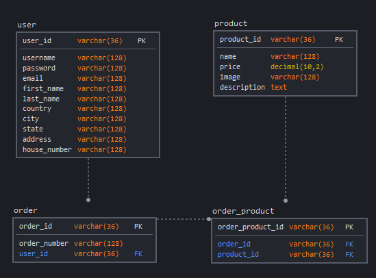

# Shop backend

My start for a shopping backend

## How to run
1. Go to root directory 
2. run ```yarn install```
3. run ```docker-compose up```
4. rename ```.env.dist``` to ```.env``` and input correct values (be sure that the database exists)
5. run ```npx knex migrate:latest```

## Database schema


## Todo

* [x] Make database schema
* [x] Create database
* [ ] Setup api routes
* [x] Setup knex
  * [x] Make migrations
* [ ] Create custom validation for [objection.js](https://vincit.github.io/objection.js/) models with [JOI](https://github.com/sideway/joi)
* [ ] add authentication with JWT
